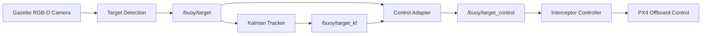

# Interceptor Drone Simulation

A simulation-based autonomous interceptor drone project developed with **PX4 SITL, Gazebo, ROS 2, YOLO, RGB-D perception, Kalman filtering, and MAVSDK Offboard control**.

The system detects a moving target from the drone camera, estimates its metric distance using depth data, filters and predicts target motion, and generates flight commands for search, alignment, approach, and interception.

## Features

* YOLO-based moving target detection
* RGB-D based metric distance estimation
* Median depth calculation inside the detected bounding box
* Kalman-based target position and motion estimation
* Autonomous target search and acquisition
* Target-loss and depth-validity handling
* PX4 Offboard alignment and approach control
* Moving and multi-object Gazebo test scenarios
* Modular ROS 2 perception and control pipeline

## Tech Stack

`PX4` `Gazebo` `ROS 2 Jazzy` `Python` `YOLO` `OpenCV` `MAVSDK` `NumPy` `Kalman Filter`

## System Architecture



The perception, state-estimation, and control stages run as separate ROS 2 nodes and communicate through dedicated topics.

### Main ROS 2 Flow

```text
RGB + Depth
     ↓
Target Detection
     ↓
/buoy/target
     ↓
Kalman Tracker
     ↓
/buoy/target_kf
     ↓
Control Adapter
     ↓
/buoy/target_control
     ↓
Interceptor Controller
     ↓
PX4 Offboard Commands
```

## Target Tracking

Raw visual detections can contain bounding-box jitter, depth spikes, and temporary detection losses.

To reduce their effect on control, the project uses a Kalman-based tracker that estimates target position and motion over time.

The state model contains position, velocity, and acceleration components:

```text
[x, y, z, vx, vy, vz, ax, ay, az]
```

Depth measurements are also validated before being used by the controller. Sudden unrealistic depth changes and stale measurements are prevented from directly affecting flight commands.

## Autonomous Control

The control pipeline was developed incrementally around four main behaviors:

```text
SEARCH → ACQUIRE → ALIGN → APPROACH / INTERCEPT
```

**SEARCH**
The drone performs yaw-based scanning when the target is outside the camera view.

**ACQUIRE**
After a reliable detection is obtained, yaw corrections move the target toward the desired image position.

**ALIGN**
Horizontal and vertical target errors are reduced before aggressive forward motion.

**APPROACH / INTERCEPT**
Forward motion is adjusted according to the measured target depth. The final depth-aware controller uses target position, confidence, measurement freshness, and depth validity when generating motion commands.

## RGB-D Processing

The final perception pipeline uses both RGB and depth information.

For each detected target:

1. YOLO provides the target bounding box.
2. Valid depth pixels inside the target region are selected.
3. Invalid and out-of-range values are rejected.
4. The median valid depth is calculated.
5. Target position, confidence, and metric distance are published to ROS 2.

Using median depth makes the distance estimate less sensitive to individual noisy depth pixels.

## Repository Structure

```text
InterceptorDroneSimulation/
│
├── start_interceptor.sh
│
├── scripts/
│   ├── detect_buoy.py
│   ├── align_buoy.py
│   ├── approach_buoy.py
│   ├── intercept_buoy.py
│   ├── intercept_depth_buoy.py
│   ├── search_buoy.py
│   ├── search_buoy_acquire.py
│   ├── kalman_buoy_tracker.py
│   ├── kalman_control_adapter.py
│   ├── move_target.py
│   ├── move_two_targets.py
│   ├── move_two_targets_vector.py
│   └── move_targets_mixed.py
│
├── models/
│   ├── red_buoy/
│   └── green_buoy/
│
├── worlds/
│   └── interceptor_world.sdf
│
└── weights/
    ├── buoy_best.pt
    └── buoy_best.onnx
```

## Key Files

### `scripts/intercept_depth_buoy.py`

Final depth-aware interceptor controller. It receives filtered target information and generates PX4 Offboard motion commands based on image alignment and target distance.

### `scripts/kalman_buoy_tracker.py`

Tracks the detected target and estimates its motion using a Kalman filter.

```text
/buoy/target → /buoy/target_kf
```

### `scripts/kalman_control_adapter.py`

Combines raw perception data with the filtered target estimate and produces the input used by the final controller.

```text
/buoy/target
/buoy/target_kf
        ↓
/buoy/target_control
```

### `scripts/search_buoy_acquire.py`

Implements autonomous target search and acquisition behavior before interception.

### `scripts/move_targets_mixed.py`

Generates moving-target scenarios used to evaluate detection, tracking, and target discrimination.

### `worlds/interceptor_world.sdf`

Custom Gazebo simulation environment used for the interceptor experiments.

## Running the Simulation

### 1. Start PX4 SITL and Gazebo

```bash
./start_interceptor.sh
```

By default, the script expects PX4 at:

```text
~/PX4-Autopilot
```

A different installation can be provided with:

```bash
PX4_DIR=/path/to/PX4-Autopilot ./start_interceptor.sh
```

### 2. Bridge RGB and Depth Topics

```bash
source /opt/ros/jazzy/setup.bash

ros2 run ros_gz_bridge parameter_bridge \
'/world/interceptor_world/model/x500_depth_0/link/camera_link/sensor/IMX214/image@sensor_msgs/msg/Image@gz.msgs.Image' \
'/depth_camera@sensor_msgs/msg/Image@gz.msgs.Image'
```

### 3. Run a Moving-Target Scenario

```bash
python3 scripts/move_targets_mixed.py
```

### 4. Start the Kalman Tracker

```bash
python3 scripts/kalman_buoy_tracker.py
```

### 5. Start the Control Adapter

```bash
python3 scripts/kalman_control_adapter.py
```

### 6. Search and Acquire the Target

```bash
python3 scripts/search_buoy_acquire.py
```

### 7. Run the Final Interceptor Controller

```bash
python3 scripts/intercept_depth_buoy.py
```

## Development Notes

The repository keeps several earlier functional stages of the project to show how the control pipeline evolved:

```text
detect_buoy.py
      ↓
align_buoy.py
      ↓
approach_buoy.py
      ↓
intercept_buoy.py
      ↓
intercept_depth_buoy.py
      ↓
Kalman-assisted tracking and control
```

This progression reflects the transition from basic visual detection to a depth-aware, filtered moving-target interception pipeline.

## Project Status

The current repository represents a **simulation prototype**.

Implemented and tested components include:

* visual target detection,
* RGB-D distance measurement,
* moving-target scenarios,
* autonomous search and acquisition,
* Kalman-based target tracking,
* filtered control input generation,
* PX4 Offboard alignment and approach behavior.

Future work includes more complex target trajectories, environmental disturbances, quantitative tracking-error evaluation, and automated simulation testing.
